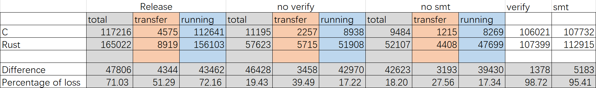

# smt_test_contracts

This project is used to test the use of [
sparse-merkle-tree](https://github.com/joii2020/sparse-merkle-tree/tree/dev_CInc) in the ```no_std``` environment and in ckb-vm

Build contracts:

``` sh
capsule build
```

Run tests:

``` sh
capsule test
```

# About testing ffi loss
The cycles_c cycles_rust and cycles_lib used to test loss.
You can get the loss value of ffi by commenting, Get the result by running run-test-cycles.sh:
* Do not comments any code
* Comment out the verify part
* Comment out SMT parts
Now, you can get the cycles of verify and smt by calculation.


